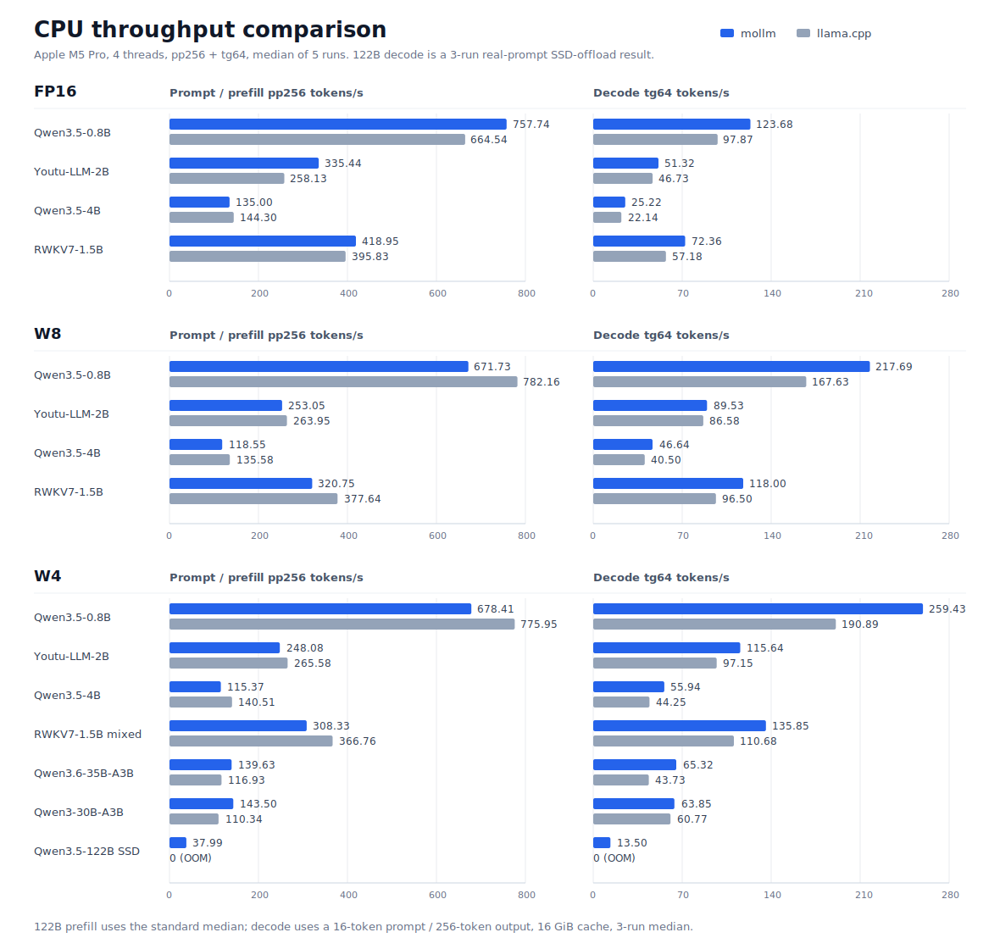

# palm-infra

AI Infra projects from Palm Team. Currently includes `mollm`.

[中文文档](README_zh.md)

## mollm

mobile-oriented LLM inference engine.
```
                 _ _
 _ __ ___   ___ | | |_ __ ___
| '_ ` _ \ / _ \| | | '_ ` _ \
| | | | | | (_) | | | | | | | |
|_| |_| |_|\___/|_|_|_| |_| |_|
```

`mollm` is a small C++ LLM runtime for ARM CPUs, with experimental Apple Metal
support. It converts supported Hugging Face model directories into one `.mollm`
file containing the graph, weights, tokenizer, and chat template, then runs
that package directly.

The current focus is fast local inference on Apple Silicon and other modern ARM
CPUs. FP16 uses NEON FP16FML kernels; quantized CPU models use weight-only int8
or int4 kernels optimized for ARM dot-product instructions.

## Now it runs a 122B model on a 48GB Mac (Or even 16GB)

`mollm` can run Qwen3.5-122B-A10B W4 on a 48GB Apple Silicon Mac by keeping
dense weights in RAM and fetching only routed MoE experts from SSD. In the
current 256-token cache sweep, a bounded, shared 16 GiB expert cache and
cross-layer prefetching provide 13.50 t/s interactive decode.

The cache is configurable rather than tied to a resident copy of the model. In
the following real-prompt sweep, the 1 GiB expert-cache configuration runs with
only 5.90 GiB peak RSS; larger caches trade memory for fewer SSD reads and
higher throughput.

| Expert RAM cache | Decode | Peak RSS | Cache hit rate | SSD reads |
|---:|---:|---:|---:|---:|
| **1 GiB** | 9.84 t/s | **5.90 GiB** | 0.0% | 587.1 GB |
| **10 GiB** | 13.21 t/s | 14.69 GiB | 83.3% | 206.1 GB |
| **16 GiB** | **13.50 t/s** | 20.61 GiB | **88.6%** | **141.4 GB** |

This sweep uses a 16-token real prompt, 256 generated tokens, greedy decoding,
`warmup=0`, and three independent process runs per cache size. The rows were
rerun on 2026-07-24. 10 GiB retains most of the 16 GiB throughput with about
5.9 GiB less peak RSS; 1 GiB demonstrates the low-memory operating point.

See [Running 122B MoE models with SSD offload](docs/ssd-offload.md) for cache
policy, memory/throughput sweeps, I/O behavior, and Perfetto tracing.

## What Works

| Model family | Status |
|---|---|
| Qwen3 dense text models | FP16, W8, W4 |
| Qwen3-30B-A3B MoE | text-only W4 path |
| Qwen3.6-35B-A3B MoE | text-only W4 path |
| Qwen3.5-122B-A10B MoE | CPU W4 with SSD expert offload |
| Qwen3.5-0.8B / Qwen3.5-4B | FP16, W8, W4, mixed W4 |
| Youtu-LLM-2B | FP16, W8, W4, mixed W4 |
| RWKV7 | FP16, W8, mixed W4; recurrent CPU prefill/decode |

The most tested runtime path today is `w4g128`: it has the lowest memory use and
the fastest decode speed in mollm. `w4mixg128` keeps selected sensitive tensors
in W8 when pure W4 loses too much quality.

## Performance

Apple M5 Pro results use four CPU threads, `pp256 + tg64`, `warmup=3`, and
independent-process medians unless noted.



[Protocol, complete CPU and Metal tables, context scaling, and correctness gates](docs/performance.md)

## Why Decode Is Fast

- Highly optimized AArch64 GEMV kernels for FP16, W8, and W4 decode.
- Decode-friendly packed weight layouts, including direct W4G128 package
  layout.
- Static reusable decode workspace to avoid per-token allocation churn.
- Prefill is still the main optimization target on dense models.

## Quick Start

```bash
cmake -G Ninja -B build_i8mm -DCMAKE_BUILD_TYPE=Release
cmake --build build_i8mm -j

# Needed for W4 conversion.
cmake --build build_i8mm --target mollm-quantize

# Convert a Hugging Face model directory.
python3 models/converter.py /path/to/Qwen3.5-4B qwen35_4b_w4g128.mollm w4g128

# Chat from the single package file.
./build_i8mm/mollm_chat --package qwen35_4b_w4g128.mollm --threads 4
```

```

                 _ _
 _ __ ___   ___ | | |_ __ ___
| '_ ` _ \ / _ \| | | '_ ` _ \
| | | | | | (_) | | | | | | | |
|_| |_| |_|\___/|_|_|_| |_| |_|

 model     : Qwen3-30B-A3B
 arch      : qwen3-moe
 layers    : 48
 hidden    : 2048
 quant     : w4g128
 ctx       : 16384
 threads   : 4

 /reset   clear context
 /quit    exit


>
```

Interactive chat commands:

```text
/reset   clear conversation context
/quit    exit
```

## Build

Requirements:

- macOS/Apple Silicon or ARM Linux
- CMake + Ninja or Make
- Python 3
- Python packages needed by conversion, especially `numpy` and `safetensors`

Recommended local build:

```bash
cmake -G Ninja -B build_i8mm -DCMAKE_BUILD_TYPE=Release
cmake --build build_i8mm -j
```

If your compiler/CPU supports ARM i8mm, the build system enables the faster int8
GEMM path automatically. A plain `build/` directory also works; replace
`build_i8mm` in the examples with your build directory.

## Convert Models

The converter auto-detects the model type from `config.json`.

```bash
# Default FP16 package.
python3 models/converter.py /path/to/Qwen3.5-4B qwen35_4b_fp16.mollm

# W8 int8 baseline.
python3 models/converter.py /path/to/Qwen3.5-4B qwen35_4b_w8pc.mollm w8pc

# W4 performance package.
python3 models/converter.py /path/to/Qwen3.5-4B qwen35_4b_w4g128.mollm w4g128

# Mixed W4 quality package.
python3 models/converter.py /path/to/Qwen3.5-4B qwen35_4b_w4mixg128.mollm w4mixg128
```

MoE example:

```bash
python3 models/converter.py \
    /path/to/Qwen3-30B-A3B \
    qwen3_30b_a3b_w4g128.mollm \
    w4g128
```

Supported `config.json` model types:

| `model_type` | Supported models |
|---|---|
| `qwen3` | Qwen3 dense text models |
| `qwen3_moe` | Qwen3 MoE text models |
| `qwen3_5` | Qwen3.5 dense text models |
| `qwen3_5_moe` | Qwen3.5/3.6 MoE text models |
| `youtu` | Youtu-LLM MLA models |
| RWKV7 `.pth` | Use `models/rwkv7.py` directly. |

Quantization choices:

| Mode | Use when |
|---|---|
| `fp16` | You want the simplest baseline and have enough memory. |
| `w8pc` | You want int8 weight-only quantization with small quality drift. |
| `w4g128` | You want the smallest package and fastest decode. This is the usual performance choice. |
| `w4mixg128` | Pure W4 quality is too low and you can spend more memory for selected W8 tensors. |

Notes:

- W4 conversion requires the `mollm-quantize` helper built from C++.
- FP16 and W8 conversion do not require that helper.
- The prefill graph is built with an internal 256-token chunk size, but CPU
  runtime prefill is dynamic: short prompts are not padded to 256 unless you
  explicitly pass `--static-padded`.
- Converted packages store a user-facing model name from the Hugging Face config
  or model directory, so chat displays names such as `Qwen3-30B-A3B`.

## Run Chat

```bash
./build_i8mm/mollm_chat --package qwen35_4b_w4g128.mollm --threads 4
```

One-shot deterministic smoke test:

```bash
./build_i8mm/mollm_chat \
    --package qwen35_4b_w4g128.mollm \
    --prompt "请只输出一句话，不要解释：杭州有什么特点？" \
    --max-new-tokens 64 \
    --threads 4 \
    --temperature 0
```

MoE chat:

```bash
./build_i8mm/mollm_chat --package qwen3_30b_a3b_w4g128.mollm --threads 4
```

By default, `mollm_chat` loads package weights into resident memory. For mmap
A/B testing, pass `--mmap`; mmap page warmup is enabled unless you also pass
`--no-load-warmup`.

## Benchmark

Standard mollm benchmark:

```bash
./build_i8mm/mollm_bench \
    --package qwen35_4b_w4g128.mollm \
    --prompt-tokens 256 \
    --max-new-tokens 64 \
    --warmup 3 \
    --threads 4
```

## Local HTTP server

```bash
./build_i8mm/mollm_server \
    --package qwen35_4b_w4g128.mollm \
    --host 127.0.0.1 --port 8080 --threads 4
```

The initial server implements `GET /v1/models` and OpenAI-compatible
`POST /v1/chat/completions`, including SSE streaming. It also retains a
single exact token-prefix KV cache between serialized requests. Generation is
currently deterministic (`temperature=0`). See [SERVER.md](SERVER.md)
for API examples and limitations.

## Project Layout

```text
mollm/
├── kernels/    ARM kernels for matmul, attention, MoE, norm, rope
├── graph/      Graph format, executor, mmap package loading, BufferPool
├── engine/     LLMEngine, tokenizer, chat/generation lifecycle
├── models/     Python converters and graph builders
├── examples/   mollm_chat, mollm_server, mollm_bench, mollm_ppl
└── tests/      Unit, stress, and end-to-end tests
```

## Roadmap

- Prefill performance optimization, especially for W8/W4 dense-model prompt
  processing.
- Improve experimental Metal performance, especially quantized prefill, MoE
  prefill, and CPU/GPU synchronization overhead.
- Full prefix caching for serving workloads, building on the current single-user
  REPL cache.
- Broader accelerator coverage while keeping the CPU runtime as the portable
  baseline.
- More model families beyond the current Qwen, Youtu, and Qwen-MoE coverage.
- Vision model support, including multimodal Qwen-style architectures.
- SSD offload for larger models and MoE experts that do not fit comfortably in
  memory.

## License

Copyright 2026 Tencent. Licensed under the Apache License 2.0. See
[LICENSE](LICENSE) and [NOTICE](NOTICE). Bundled dependency notices are in
[THIRD_PARTY_NOTICES.md](THIRD_PARTY_NOTICES.md).

## Acknowledgments

- [Cider](https://github.com/Mininglamp-AI/cider), whose work on W8A8/W4A8
  inference with Metal 4 INT8 TensorOps on Apple Silicon informed mollm's
  experimental quantized Metal path.
- Fang et al.'s [Fate](https://arxiv.org/abs/2502.12224), whose cross-layer
  gate prediction inspired mollm's experimental expert-prefetch path.
