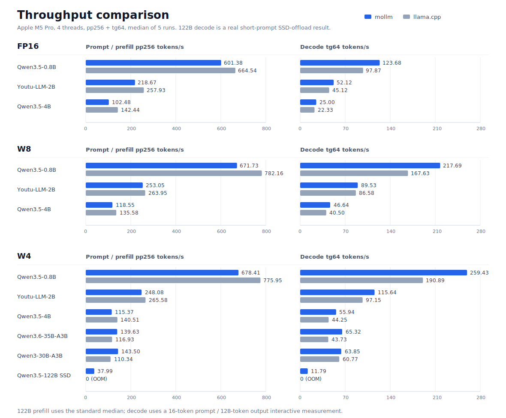
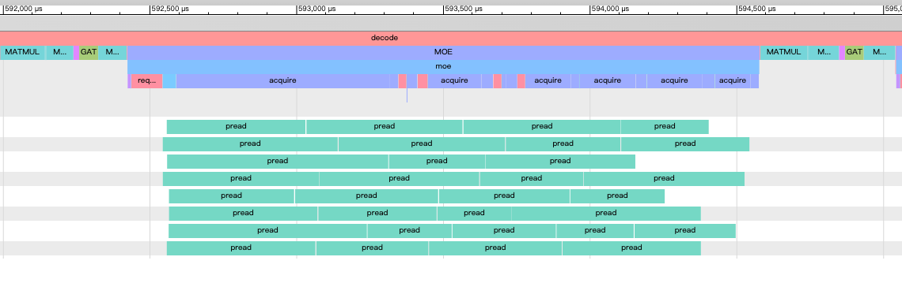

# palm-infra

Palm Team 的 AI Infra 项目，目前包含 `mollm`。完整英文说明见 [README.md](README.md)。

## mollm

mobile-oriented LLM inference engine.
```
                 _ _
 _ __ ___   ___ | | |_ __ ___
| '_ ` _ \ / _ \| | | '_ ` _ \
| | | | | | (_) | | | | | | | |
|_| |_| |_|\___/|_|_|_| |_| |_|
```

`mollm` 是面向 ARM CPU 的轻量 C++ LLM 推理引擎，并提供实验性的 Apple Metal 支持。它将已支持的 Hugging Face 模型目录转换成单个 `.mollm` 文件，其中包含计算图、权重、tokenizer 与对话模板，并可直接运行。

项目当前聚焦 Apple Silicon 和其他现代 ARM 处理器上的高性能本地推理：FP16 使用 NEON FP16FML kernel；CPU 量化模型使用针对 ARM dot-product 指令优化的 weight-only int8/int4 kernel。

## 现在，48GB Mac 也能运行 122B 模型

`mollm` 可以在 48GB Apple Silicon Mac 上运行 W4 量化的
Qwen3.5-122B-A10B：始终需要的稠密权重锁定在 RAM 中，仅通过异步
`pread` worker 从包文件读取被路由到的 MoE expert pair。RAM cache 保存近期
使用过的、由 SSD 提供的 expert pair，并受 `--ssd-cache-mb` 限制；因此这是
真正的 SSD offload 路径，而非完整常驻的 122B 模型。

以下为真实 chat prompt、4 CPU 线程、16 个 prompt token、生成 128 个 token、
`warmup=1`、稠密权重锁定，且 5 个独立进程取中位数的数据：

| 16 GiB cache 策略 | Decode | Expert-cache 命中率 | SSD 读取量 |
|---|---:|---:|---:|
| 旧的逐层均分 cache、无预测 | 10.89 t/s | 74.5% | 69.4 GB |
| **默认共享 cache + 跨层预取** | **13.54 t/s** | **89.3%** | 75.7 GB |

默认策略使用一个全局 RAM 池，取代固定的逐层配额。Least-Stale eviction 会保护
本轮与未来层的 expert；下一层 router 预测会提前提交低优先级读取。预测会略微增加
SSD 读取量，但隐藏了更多 I/O 延迟。相同 16 GiB 默认配置在严格的
`pp256 + tg64`、`warmup=3` 协议下，五个独立进程的中位数为 37.99 pp / 8.46 tg；
它的 decode 起始上下文比上面的交互式测量长得多（256 token）。

后续会做 cache-aware 的预取准入策略，并尝试在 MoE 层实际需要 expert 前、
于 attention 阶段预测和预取路由 expert。

## 已支持的模型

| 模型系列 | 状态 |
|---|---|
| Qwen3 dense text models | FP16、W8、W4 |
| Qwen3-30B-A3B MoE | 仅文本 W4 路径 |
| Qwen3.6-35B-A3B MoE | 仅文本 W4 路径 |
| Qwen3.5-122B-A10B MoE | CPU W4，支持 SSD expert offload |
| Qwen3.5-0.8B / Qwen3.5-4B | FP16、W8、W4、混合 W4 |
| Youtu-LLM-2B | FP16、W8、W4、混合 W4 |

当前测试最充分的运行路径是 `w4g128`：它占用内存最少，且具有 mollm 中最快的 decode 速度。若纯 W4 的质量不足，可使用 `w4mixg128`，它会保留部分敏感 tensor 为 W8。

## 性能



除非另有说明，下列数据使用 Apple M5 Pro、4 线程、`pp256 + tg64`、`warmup=3`，5 个独立进程取中位数。`pp` 是 prompt/prefill token/s，`tg` 是生成/decode token/s。122B 行（†）使用真实 prompt 的 SSD-offload 交互测量；其严格 `pp256 + tg64` 中位数见上文。

### FP16

| 模型 | mollm pp/tg | llama.cpp pp/tg | 结果 |
|---|---:|---:|---|
| Qwen3.5-0.8B | 601.38 / **123.68** | **664.54** / 97.87 | llama prefill 更快，mollm decode 更快 |
| Youtu-LLM-2B | 236.12 / **51.32** | **258.13** / 46.73 | llama prefill 更快，mollm decode 更快 |
| Qwen3.5-4B | 104.37 / **25.22** | **144.30** / 22.14 | llama prefill 更快，mollm decode 更快 |

### W8

| 模型 | mollm W8 pp/tg | llama.cpp Q8_0 pp/tg | 结果 |
|---|---:|---:|---|
| Qwen3.5-0.8B | 671.73 / **217.69** | **782.16** / 167.63 | llama prefill 更快，mollm decode 更快 |
| Youtu-LLM-2B | 253.05 / **89.53** | **263.95** / 86.58 | prefill 接近，mollm decode 略快 |
| Qwen3.5-4B | 118.55 / **46.64** | **135.58** / 40.50 | llama prefill 更快，mollm decode 更快 |

### W4 / MoE W4

| 模型 | mollm pp/tg | llama.cpp pp/tg | 结果 |
|---|---:|---:|---|
| Qwen3.5-0.8B W4 | 678.41 / **259.43** | **775.95** / 190.89 | llama prefill 更快，mollm decode 更快 |
| Youtu-LLM-2B W4 | 248.08 / **115.64** | **265.58** / 97.15 | llama prefill 更快，mollm decode 更快 |
| Qwen3.5-4B W4 | 115.37 / **55.94** | **140.51** / 44.25 | llama prefill 更快，mollm decode 更快 |
| Qwen3.6-35B-A3B W4 | **139.63** / **65.32** | 116.93 / 43.73 | mollm prefill 1.19×，decode 1.49× |
| Qwen3-30B-A3B W4 | **143.50** / **63.85** | 110.34 / 60.77 | mollm prefill 1.30×，decode 1.05× |
| Qwen3.5-122B-A10B W4（SSD offload） | **37.99** / **13.54** † | OOM | 可运行于 48GB Mac |

† Prefill 为标准 `pp256 + tg64`、`warmup=3` 的五进程中位数。Decode 为真实
ChatML prompt（16 个 prompt token、生成 128 个 token、`warmup=1`）的五进程中位数。
两者均使用 16 GiB 的 SSD-backed expert RAM cache、默认的共享 cache / 跨层预取策略和
锁定的稠密 mmap 权重。llama.cpp 的 CPU 基线无法装入 48GB RAM。

总体而言，mollm 的 decode 在 W4 包上尤其有竞争力；稠密模型的 prefill 仍是主要优化方向。

## 分析 SSD I/O overlap

`mollm_chat` 与 `mollm_bench` 都支持 `--trace <path.json>`，会在进程退出时写出
Chrome Trace / Perfetto 时间线。将 JSON 导入 [Perfetto](https://ui.perfetto.dev/)，即可查看
prefill/decode、逐层 MoE routing 和 expert compute、cache 的 `request_many` / `acquire`，
以及各 SSD I/O worker 合并后的 `pread` 操作。flow arrow 会连接排队的读取任务与完成它的
worker，因此很容易发现 I/O overlap 不足或队列深度不够的问题。

```bash
./build/mollm_bench \
    --package /path/to/qwen35_122b_a10b_w4g128_ssd.mollm \
    --ssd-cache-mb 16384 --ssd-io-workers 8 --threads 4 \
    --prompt "讲一个短故事" --max-new-tokens 128 --warmup 1 \
    --trace /tmp/mollm_122b_trace.json
```



## 快速开始

```bash
cmake -G Ninja -B build_i8mm -DCMAKE_BUILD_TYPE=Release
cmake --build build_i8mm -j

# W4 转换需要此工具。
cmake --build build_i8mm --target mollm-quantize

# 转换 Hugging Face 模型目录。
python3 models/converter.py /path/to/Qwen3.5-4B qwen35_4b_w4g128.mollm w4g128

# 从单个包文件启动对话。
./build_i8mm/mollm_chat --package qwen35_4b_w4g128.mollm --threads 4
```

交互命令：

```text
/reset   清空对话上下文
/quit    退出
```

## 构建

依赖：

- macOS/Apple Silicon 或 ARM Linux
- CMake 与 Ninja 或 Make
- Python 3
- 转换所需的 Python 包，主要是 `numpy` 与 `safetensors`

推荐构建方式：

```bash
cmake -G Ninja -B build_i8mm -DCMAKE_BUILD_TYPE=Release
cmake --build build_i8mm -j
```

若编译器和 CPU 支持 ARM i8mm，构建系统会自动启用更快的 int8 GEMM 路径。普通 `build/` 目录也可以使用；将示例中的 `build_i8mm` 替换为对应目录即可。

## 转换模型

转换器会从 `config.json` 自动识别模型类型。

```bash
# 默认 FP16 包。
python3 models/converter.py /path/to/Qwen3.5-4B qwen35_4b_fp16.mollm

# W8 int8 基线。
python3 models/converter.py /path/to/Qwen3.5-4B qwen35_4b_w8pc.mollm w8pc

# W4 性能包。
python3 models/converter.py /path/to/Qwen3.5-4B qwen35_4b_w4g128.mollm w4g128

# 混合 W4 质量包。
python3 models/converter.py /path/to/Qwen3.5-4B qwen35_4b_w4mixg128.mollm w4mixg128
```

MoE 示例：

```bash
python3 models/converter.py \
    /path/to/Qwen3-30B-A3B \
    qwen3_30b_a3b_w4g128.mollm \
    w4g128
```

| `model_type` | 支持的模型 |
|---|---|
| `qwen3` | Qwen3 dense text models |
| `qwen3_moe` | Qwen3 MoE text models |
| `qwen3_5` | Qwen3.5 dense text models |
| `qwen3_5_moe` | Qwen3.5/3.6 MoE text models |
| `youtu` | Youtu-LLM MLA models |

| 模式 | 适用场景 |
|---|---|
| `fp16` | 最简单的基线，且内存充足。 |
| `w8pc` | 需要 weight-only int8 量化，允许轻微质量偏移。 |
| `w4g128` | 需要最小包大小和最快 decode；通常是性能首选。 |
| `w4mixg128` | 纯 W4 质量不足，可使用更多内存保留部分 W8 tensor。 |

W4 转换需要 C++ 构建的 `mollm-quantize` 工具；FP16 和 W8 不需要。prefill 图内部以 256 token 为分块大小，但 CPU runtime 使用 dynamic prefill；除非显式指定 `--static-padded`，短 prompt 不会 padding 到 256。

## 运行对话

```bash
./build_i8mm/mollm_chat --package qwen35_4b_w4g128.mollm --threads 4
```

一次性、确定性的 smoke test：

```bash
./build_i8mm/mollm_chat \
    --package qwen35_4b_w4g128.mollm \
    --prompt "请只输出一句话，不要解释：杭州有什么特点？" \
    --max-new-tokens 64 \
    --threads 4 \
    --temperature 0
```

默认情况下，`mollm_chat` 以 resident 模式加载包内权重。若需 mmap A/B 测试，传入 `--mmap`；默认 mmap 页面 warmup 已启用，可搭配 `--no-load-warmup` 关闭。

## 基准测试

```bash
./build_i8mm/mollm_bench \
    --package qwen35_4b_w4g128.mollm \
    --prompt-tokens 256 \
    --max-new-tokens 64 \
    --warmup 3 \
    --threads 4
```

## 本地 HTTP 服务

```bash
./build_i8mm/mollm_server \
    --package qwen35_4b_w4g128.mollm \
    --host 127.0.0.1 --port 8080 --threads 4
```

初始 server 提供 `GET /v1/models` 和 OpenAI 兼容的 `POST /v1/chat/completions`（含 SSE streaming）。它在串行请求间保留一个精确 token-prefix KV cache。生成当前为确定性模式（`temperature=0`）。详见 [SERVER.md](SERVER.md) 的 API 示例与限制。

## 项目结构

```text
mollm/
├── kernels/    matmul、attention、MoE、norm、rope 的 ARM kernel
├── graph/      计算图格式、执行器、mmap 包加载、BufferPool
├── engine/     LLMEngine、tokenizer、对话/生成生命周期
├── models/     Python 转换器与计算图构建器
├── examples/   mollm_chat、mollm_server、mollm_bench、mollm_ppl
└── tests/      单元、压力与端到端测试
```

## 路线图

- 优化 prefill 性能，特别是 W8/W4 稠密模型的 prompt 处理。
- 提升实验性 Metal 性能，重点是量化 prefill、MoE prefill 与 CPU/GPU 同步开销。
- 基于当前单用户 REPL cache，为 serving 工作负载实现完整的 prefix cache。
- 扩展 accelerator 覆盖范围，同时保持 CPU runtime 作为可移植基线。
- 增加更多模型系列、视觉模型支持以及 SSD offload。

## 许可证

Copyright 2026 Tencent。根据 Apache License 2.0 发布；详见 [LICENSE](LICENSE) 与 [NOTICE](NOTICE)。捆绑依赖的声明见 [THIRD_PARTY_NOTICES.md](THIRD_PARTY_NOTICES.md)。

## 致谢

- [Cider](https://github.com/Mininglamp-AI/cider)：其在 Apple Silicon 上使用 Metal 4 INT8 TensorOps 实现 W8A8/W4A8 推理的工作，为 mollm 实验性的量化 Metal 路径提供了启发。
- Fang 等人的 [Fate](https://arxiv.org/abs/2502.12224)：其跨层 gate 预测思路为 mollm 实验性的 expert 预取路径提供了启发。
