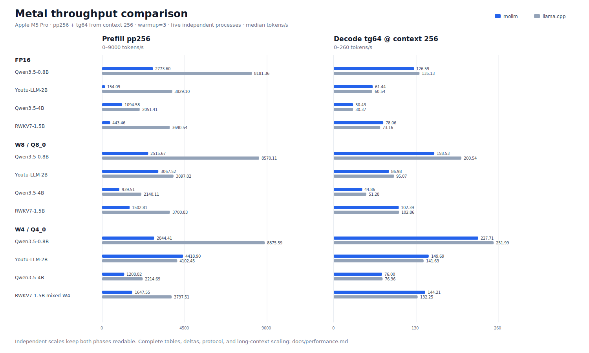

# Performance

This page collects the CPU and Metal benchmark results used by the README.

## CPU

These results compare mollm with llama.cpp on an Apple M5 Pro using four CPU
threads. Unless a row says otherwise, the protocol is `pp256 + tg64`,
`warmup=3`, five independent processes, and the median throughput. `pp` is
prompt/prefill tokens per second; `tg` is generated/decode tokens per second.

## FP16

On Apple platforms, mollm uses Accelerate SGEMM for eligible large FP16
prefill GEMMs.

| Model | mollm pp/tg | llama.cpp pp/tg | Result |
|---|---:|---:|---|
| Qwen3.5-0.8B | **757.74** / **123.68** | 664.54 / 97.87 | mollm faster prefill and decode |
| Youtu-LLM-2B | **335.44** / **51.32** | 258.13 / 46.73 | mollm faster prefill and decode |
| Qwen3.5-4B | 135.00 / **25.22** | **144.30** / 22.14 | llama faster prefill, mollm faster decode |
| RWKV7-1.5B | **418.95** / **72.36** | 395.83 / 57.18 | mollm faster prefill and decode |

## W8

| Model | mollm W8 pp/tg | llama.cpp Q8_0 pp/tg | Result |
|---|---:|---:|---|
| Qwen3.5-0.8B | 671.73 / **217.69** | **782.16** / 167.63 | llama faster prefill, mollm faster decode |
| Youtu-LLM-2B | 253.05 / **89.53** | **263.95** / 86.58 | close prefill, mollm slightly faster decode |
| Qwen3.5-4B | 118.55 / **46.64** | **135.58** / 40.50 | llama faster prefill, mollm faster decode |
| RWKV7-1.5B | 320.75 / **118.00** | **377.64** / 96.50 | llama faster prefill, mollm faster decode |

## W4

| Model | mollm W4 pp/tg | llama.cpp Q4_0 pp/tg | Result |
|---|---:|---:|---|
| Qwen3.5-0.8B | 678.41 / **259.43** | **775.95** / 190.89 | llama faster prefill, mollm faster decode |
| Youtu-LLM-2B | 248.08 / **115.64** | **265.58** / 97.15 | llama faster prefill, mollm faster decode |
| Qwen3.5-4B | 115.37 / **55.94** | **140.51** / 44.25 | llama faster prefill, mollm faster decode |
| RWKV7-1.5B mixed W4 | 308.33 / **135.85** | **366.76** / 110.68 | llama faster prefill, mollm faster decode |

RWKV7 uses sparse-A FFN GEMV where it improves endpoint performance; mixed W4
keeps dense q4-dot GEMV by default.

## MoE W4

| Model | mollm W4 pp/tg | llama.cpp Q4_0 pp/tg | Result |
|---|---:|---:|---|
| Qwen3.6-35B-A3B | **139.63** / **65.32** | 116.93 / 43.73 | mollm 1.19x prefill, 1.49x decode |
| Qwen3-30B-A3B | **143.50** / **63.85** | 110.34 / 60.77 | mollm 1.30x prefill, 1.05x decode |
| Qwen3.5-122B-A10B (SSD offload) | **37.99** / **13.50** † | OOM | runs on a 48GB Mac |

† Prefill is the five-process `pp256 + tg64`, `warmup=3` median. Decode is the
current three-process median on a real ChatML prompt with 16 prompt tokens,
256 generated tokens, `warmup=0`, and a 16 GiB SSD-backed expert cache. See
[SSD offload](ssd-offload.md) for the cache sweep and I/O protocol.

Packages are resident by default. `--mmap` remains available for CPU A/B
testing; mmap page warmup is reported separately from measured prefill and
decode time.

## Metal

Metal support is experimental. The current optimized path covers resident
FP16, W8, and W4 packages. Results below use the same Apple M5 Pro, four CPU
threads, `warmup=3`, five independent processes, and median throughput.

For mollm, `--prompt-tokens 256 --max-new-tokens 65` produces one prefill token
and exactly 64 timed decode tokens. For llama.cpp, prefill and decode are
separate processes: `-p 256 -n 0` and `-p 0 -n 64 -d 256`. The latter matters:
it measures tg64 with an existing 256-token context rather than the faster
empty-context decode path. Both runtimes keep model weights on Metal.

### FP16

| Model | mollm Metal pp/tg | llama.cpp Metal pp/tg | Decode difference |
|---|---:|---:|---:|
| Qwen3.5-0.8B | 2773.60 / 126.59 | **8181.36** / **135.13** | -6.3% |
| Youtu-LLM-2B | 154.09 / **61.44** | **3829.10** / 60.54 | +1.5% |
| Qwen3.5-4B | 1094.58 / **30.43** | **2051.41** / 30.37 | +0.2% |
| RWKV7-1.5B | 443.46 / **78.06** | **3690.54** / 73.16 | +6.7% |

### W8

| Model | mollm Metal W8 pp/tg | llama.cpp Metal Q8_0 pp/tg | Decode difference |
|---|---:|---:|---:|
| Qwen3.5-0.8B | 2515.67 / 158.53 | **8570.11** / **200.54** | -20.9% |
| Youtu-LLM-2B | 3067.52 / 86.98 | **3897.02** / **95.07** | -8.5% |
| Qwen3.5-4B | 939.51 / 44.86 | **2140.11** / **51.28** | -12.5% |
| RWKV7-1.5B | 1502.81 / 102.39 | **3700.83** / **102.86** | -0.5% |

### W4

| Model | mollm Metal W4 pp/tg | llama.cpp Metal Q4_0 pp/tg | Decode difference |
|---|---:|---:|---:|
| Qwen3.5-0.8B | 2844.41 / 227.71 | **8875.59** / **251.99** | -9.6% |
| Youtu-LLM-2B | **4418.90** / **149.69** | 4102.45 / 141.63 | +5.7% |
| Qwen3.5-4B | 1208.82 / 76.00 | **2214.69** / **76.96** | -1.2% |
| RWKV7-1.5B mixed W4 | 1647.55 / **144.21** | **3797.51** / 132.25 | +9.0% |

Metal decode is competitive on the larger FP16 and W4 cases, but it is not yet
a blanket speedup: Qwen 0.8B and the W8 models remain behind llama.cpp. Metal
prefill also trails llama.cpp for most models. Youtu FP16 prefill is an
especially slow fallback path; Youtu W4 is the optimized path.

### Youtu W4 context scaling

The context-256 row below is the current five-process matrix result. The 1024-
and 4096-token rows are earlier three-process medians used to show scaling.

| tg64 starting context | mollm Metal | llama.cpp Metal | Difference |
|---|---:|---:|---:|
| 256 | **149.69 t/s** | 141.63 t/s | +5.7% |
| 1024 | **133.23 t/s** | 131.35 t/s | +1.4% |
| 4096 | 88.52 t/s | **93.02 t/s** | -4.8% |

Youtu's `DK=192, DV=128` decode path fuses QK, online softmax, and P×V. At
context 768 and above, 32 workgroups per head produce independent online
softmax states and a second kernel combines them. Other attention shapes use
the generic fallback.

Correctness gates include Metal operator parity at past lengths from 0 through
1023 with `3e-3` tolerance, finite CPU/Metal CE and PPL, exact deterministic
Youtu W4 generation, and the complete Metal CTest suite.
